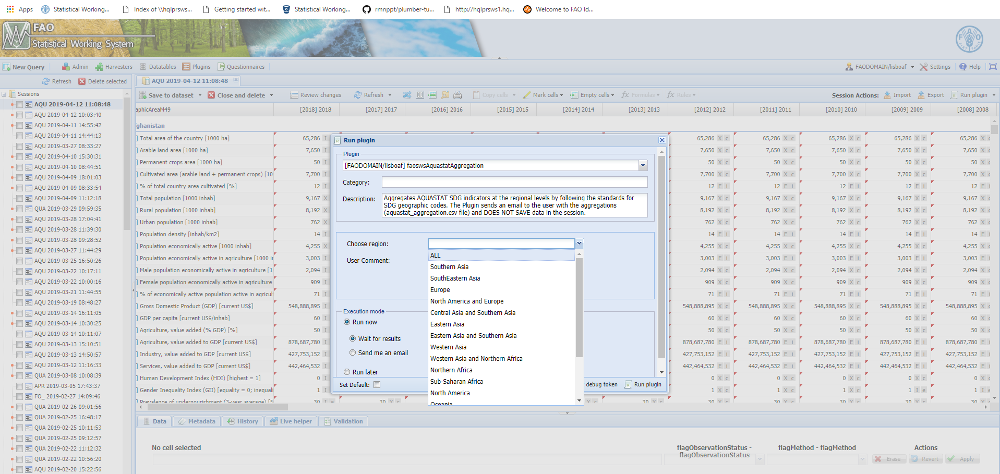

# **The faoswsAquastatAggregation module** {#Aggregation}

## **Aims**

The faoswsAquastatAggregation produces the regional aggregations of the SDG 6.4.1 (Water Use Efficiency) and 6.4.2 (Water Stress) following the guidelines for SDG regional aggregates. The input for this module is the dataset from the **faoswsAquastatUpdate** module.


### **Calculate region-specific aggregations for SDG 6.4.2**

The aggregation of the SDG 6.4.1 (Water Stress) is region-specific, which means that for each region there is a specific equation. The equations differ from each other in terms of an element(s) that need to add or discount from the aggregates final regional aggregates. These elements, in turn, are country-specific. Therefore, the equations have a fixed part that aggregates elements at the regional level a variable part representing element values at the country level. 

To account for the information necessary to aggregate the SDGs, the SWS has a data table named **aqua_sdg_agg**, which contains the fixed and variable part of the aggregating equations. In the table below, **aqua_sdg_agg**, the columns are:

- **regional_el_code**. This column tells the faoswsAquastatAggregation module which elements MUST be aggregated at the regional level **fixed part** of the equation.

- **relevant_el_code**. This column has the elements whose values should be added/discount to the fixed part of the equation;

- **countr_el_code**. This column indicates the countries in each regional aggregate the elements in the column **relevant_el_code** should be taken from;

- **addition**. The formulas with the country-specific elements that should be added/discounted to the final region-specific aggregate.

- **sdg_region**. The codes of the regions the SDG should be aggregated for;

- **group_order_name**. The name of the regions the SDG should be aggregated for;

- **column_to_select**. The columns in the SWS data table **a2017regionalgroupings_SDG_02Feb2017** from each the codes in the **sdg_region** code were taken from. This data table comes from the Loss and Waste SWS domain, and its use in the **faoswsAquastatAggregation**  module was kindly granted by Ms **Alicia English** (Food Waste and Loss consultant in the ESS - SWS team).

- **transboundary**. A binary column with 1 (equations accounting for country-specific elements, i.e., using the column addition) and 0 ( equation where country-specific elements do not need to be considered for);

- **indicator**. A column with the aquastatElement code for the SDG 6.4.1 (4551) and SDG 6.4.2 (4550).

<br>
```{r aquasdgdt, echo=FALSE, message=FALSE}
require(data.table)
require(kableExtra)
d = data.table::fread("tables/aqua_sdg_agg.csv")
knitr::kable(d, 
             escape = F, 
             table.attr='class="table-fixed-header"',
             caption = "The SWS aqua_sdg_agg data table") %>%
  kableExtra::kable_styling(font_size = 12) %>% 
   scroll_box(width = "100%", height = "500px")
```

<br>
<br>
<br>

```{r relnames, echo=FALSE, message=FALSE}
require(data.table)
require(kableExtra)
rel <- c("4263", "4157", "4549", "4188", "4160", "4162", "4174", "4168", 
"4103", "4379", "4250", "4251", "4252", "4253", "4254", "4255", 
"4256", "4546", "4547", "4548", "4557", "4558")

d = data.table::fread("tables/aquastat_reference.csv")
d <- d[element_code %in% rel, .(element_code, element_name)]
knitr::kable(d, 
             # escape = F, 
             # table.attr='class="table-fixed-header"',
             caption = "Relevant AQUASTAT elements in the aqua_sdg_agg data table") %>%
  kableExtra::kable_styling(font_size = 12) %>% 
   scroll_box(width = "100%", height = "500px")
```

<br>
<br>

### **Calculate region-specific aggregations for SDG 6.4.1**

Different from the SDG 6.4.2, the regional aggregations of the SDG 6.4.2 do not have a national component that varies from region to region. Therefore, the aggregates are done by summarizing the elements composing the SDG 6.4.1 intermediates and then obtain the SDG 6.4.1 aggregation at the regional level. The formulas for the SDG 6.4.1 and its intermediates are in the column **addition** of the SWS **aqua_sdg_agg** data table. 


### **Send the result to the user email**
The output of the faoswsAquastatAggregation module is a large pivot dataset that is sent by email to the user (FAO corporate email). The output looks like the table below.
<br>

```{r aggout, echo=FALSE, message=FALSE}
require(data.table)
require(kableExtra)

d = data.table::fread("tables/agg_output.csv")
knitr::kable(d, 
             # escape = F, 
             # table.attr='class="table-fixed-header"',
             caption = "Relevant AQUASTAT elements in the aqua_sdg_agg data table") %>%
  kableExtra::kable_styling(font_size = 12) %>% 
   scroll_box(width = "100%", height = "500px")
```

## **Workflow**
```{r fig1, echo=FALSE, fig.cap='Workflow of the faoswsAquastatExternal module.'}

library(DiagrammeR)
DiagrammeR::grViz("digraph {

graph [layout = dot, rankdir = LR]

# define the global styles of the nodes. We can override these in box if we wish
node [shape = rectangle, style = filled, fillcolor = Linen]

# Inputs
input [label = 'Dataset: \n aquastat_update', shape = folder, fillcolor = Beige]

# data tables
aquasdg [label = 'Data table: \n aqua_sdg_agg dataset \n with equations for SDG aggregation',  shape = folder, fillcolor = LightGrey]
cgcsv [label = 'Data table: \n a2017regionalgroupings_sdg_feb2017 data \n with sdg reional codes',  shape = folder, fillcolor = LightGrey]


# processing
aggmodule [label = ' Processing: \n faoswsAquastatAggregate using:\n 1. read in aquastat_update dataset from the session, \n 2. extracts information from data tables, \n 3. use information to aggregate SDGs at the regional level, \n 4. Sent the result to the user email', shape = losangle, fillcolor = PaleGreen]


# Output
Output [label = 'Dataset: \n aquastat_aggregation \n SDG aggregated data sent to the user', shape = folder, fillcolor = Beige]

# Flow
# edge definitions with the node IDs
{input} -> aggmodule -> Output
{aquasdg, cgcsv} -> aggmodule
}")

```
<br>
<br>

##**Running the module**

1. After running the **faoswsAquastatUpdate** module, wait for the result to pop up in the session;
<br>
```{r popsession,  echo=FALSE, out.width="100%", fig.cap='aquastat_update populated session from the faoswsAquastatUpdate module.'}
knitr::include_graphics("images/agg_popsession.png")
```
<br>
2. Once the session is populated with the aquastat_update dataset, click on **Run plugin**;

3. Select **faoswsAquastatAggregation** module and Choose the region to get the SDG aggregates from;
<br>
```{r choosereg,  echo=FALSE, out.width="100%", fig.cap='Choose the Aggregation module and the region.'}

```
<br>
4. Click on **Run plugin** and wait for the end of the processing;

5. Check your FAO corporate email;

```{r aggcheckemail,  echo=FALSE, out.width="100%", fig.cap='Steps 1 to 4'}
knitr::include_graphics("images/agg_checkemail.png")
```
<br>
<br>
```{block , type='rmdimportant'}

The **faoswsAquastatAggregation** DOES NOT SAVE any result on the session. Aggregates are meant to be performed on the fly at the user convenience using as input the aquastat_update dataset.

```

## **Did the module..**

```{block , type='rmdnote'}

The module has met the expectations concerning SDG regional aggregations.

```