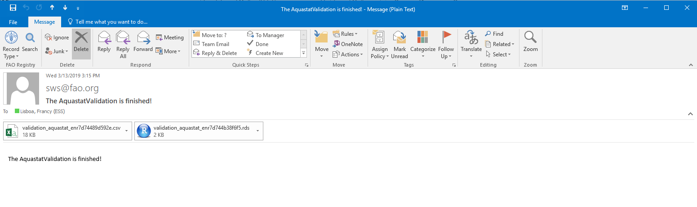

# **The faoswsAquastatValidation module** {#AquastatValidation}

## **Aims**

The faoswsAquastatValidation emerges as a demand for quality assurance and quality checking tool (QA/QC) that screens AQUASTAT data sets to identify potential issues in the data. The idea is to identify and output a data set containing the information on **what** (elements), **where** (geographic areas), and **when** (year) the domain-knowledge in form of validation rules (logical tests) was violated. Thus, the faoswsAquastatValidation module: 


### **Applies validation rules**

The validation module uses the AQUASTAT domain-knowledge converted into validation rules to identify errors in the data. The validation rules are logical test pre-defined by the technical unit and stored by the ESS-SWS team as an SWS data table called **validation_rule_clone** see \@ (tab:tab14).

- The columns **lhs** and **rhs** represent the left and right sides of the validation rule expression. 
- The **operator** the relationship between lhs and rhs that should be tested. 
- The **priority** is a binary variable with 1 (MUST CHECK) and 0 (SHOULD CHECK).


```{r tab14, echo=FALSE, message=FALSE}
library(data.table)
library(kableExtra)
d = data.table::fread("tables/validation_rules_clone.csv")
knitr::kable(d, 
             escape = F, table.attr='class="table-fixed-header"',
             caption = paste("Validation rule data table in SWS"),
             booktabs = TRUE) %>%
  kableExtra::kable_styling(font_size = 12)
```


### **Focuses on high priority rules**

The module ratains the rows in the input dataset that violated one or more **PRIORITY** validation rules. 

### **Reshapes and adds names to data**

The modules reshapes the faulty-rules dataset to a long-format and adds to it the geographicAreaM49 and AQUASTAT element names.

### **Sends the output to the user email**

With geographicAreaM49 and AQUASTAT elements in the output facilitating the interpretation, the module sends the output as **.csv file** to the user email (FAO corporate account). The .csv file attached in the email is named **validation_name of the dataset input in SWS.csv** and has the following columns:

- **geographic_area_description**. The name of the country indicating *where* the validation rule (expression) did not pass the logical test;

- **timePointYears**. The year indicating *when* the validation rule (expression) did not pass the logical test;

- **aquastatElement**. The aquastatElement code;

- **aquastatElement description**. The aquastatElement name(s) in the failing validation rule (expression);

- **Value**. The values of aquastatElement(s) in the geographic area and year that may be potentially erroneous;

- **flagObservationStatus** (if input has the flagObservationStatus dimension) or **flagAquastat** (if input is the aquastat_enr data set). The flag of the potentially erroneous values;

- **flagMethod** (if input has the flagMethod dimension). The flag pointing the method used to obtain the potentially erroneous values;

- **expression**. The validation rule that was violated and detected by the module.


## **Workflow**
```{r val, echo=FALSE, fig.cap='faoswsAquastatValidation module workflow', message=FALSE, warning=FALSE}
require(DiagrammeR)
DiagrammeR::grViz("digraph {
                  
                  graph [layout = dot, rankdir = TB]
                  
                  # define the global styles of the nodes. We can override these in box if we wish
                  node [shape = rectangle, style = filled, fillcolor = Linen]
                  
                  # Inputs
                  aqualegorig [label = 'Dataset: \n aquastat_legacy', shape = folder, fillcolor = Beige]
                  aquaext [label = 'Dataset: \n aquastat_external', shape = folder, fillcolor = Beige]    
                  aquaquest [label = 'Dataset: \n aquastat_questionnaire', shape = folder, fillcolor = Beige] 
                  aquaup [label = 'Dataset: \n aquastat_update', shape = folder, fillcolor = Beige] 


                  module [label = 'Processing: \n faoswsAquastatValidation module \n 1.Applies validation rules \n 2. Retains violated rows, \n 3. Reshape data and add names \n to geographicAreaM49 and AQUASTAT element codes', shape = folder, fillcolor = LightBlue]
                  
                  # Output
                  output [label = 'Email: \n validation_.csv to the user', shape = folder, fillcolor = Yellow] 
                
                  # Flow
                  # edge definitions with the node IDs
                  {aqualegorig, aquaext,aquaquest, aquaup } -> module  -> output
                  }")
```

<br>
<br>

## **Running the module in the SWS**

1. Log into the SWS;

2. Click on the **New Query** button;

3. Choose **Aquastat domain**;

4. Choose an AQUASTAT dataset to be screened (remember they are the inputs!);

5. Select all countries, all elements, and all years;

6. Click on **Run** beside the save button to query the data;

```{r  fig17, echo=FALSE, out.width="100%", fig.cap=' Running the module in SWS: steps 1 to 6'}
knitr::include_graphics("images/query.JPG")
```  

7. Click on the **Run plugin** button;

8. Select the faoswsAquastatValidation module and click on the **Run plugin** button;

```{r  fig18, echo=FALSE, out.width="100%", fig.cap=' Running the module in SWS: steps 7 to 8'}
knitr::include_graphics("images/validationselectplugin.PNG")
```  

9. Wait for the output in your FAO email inbox; 
```{r  fig19, echo=FALSE, out.width="100%", fig.cap=' Running the module in SWS: step 9'}
knitr::include_graphics("images/validationwaitemail.PNG")
```  

10. Check your inbox.
  - The send is **'sws@fao.org'**.
  - The subject is **'The AquastatValidation is finished'**.
  - The .csv file name is **validation_nameofthedataset.csv**.
  
```{r  fig20, echo=FALSE, out.width="100%", fig.cap=' Running the module in SWS: step 10'}

```  
  


## **Did the module**...

```{block , type='rmdnote'}

**FINAL REMARKS:**

*The faoswsAquastatValidation module shows that it is possible to use the domain-knowledge translated into validation rules stored as SWS data table to identify and locate potential errors in AQUASTAT - SWS framework data sets. By returning the areas, years, elements, values, flags, and expressions with potentially erroneous values, the module gives ammunition to the user to reduce the scope of the Quality Assurance and Quality Control process. As a consequence, the tool makes it easier to identify the nature of the errors and implement data correction based on the user domain - knowledge.*

```
 


