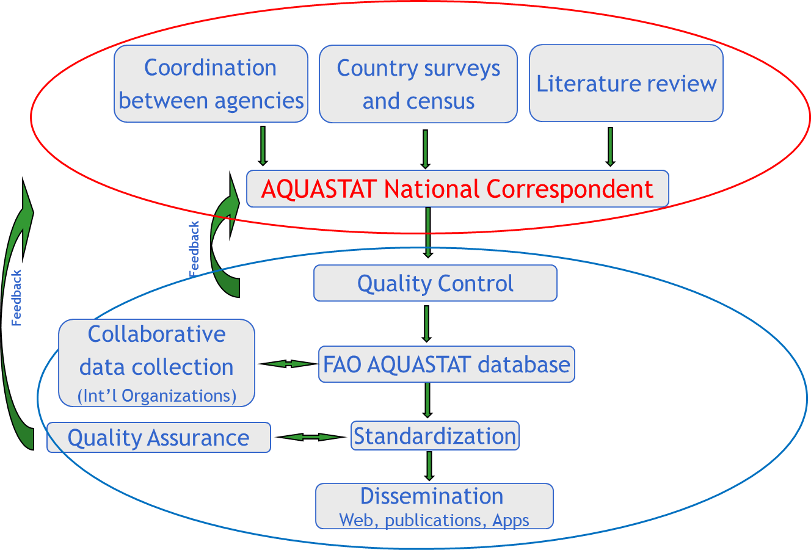

--- 
title: "Migration of AQUASTAT Statistical Processes into the SWS"
author: "Francy Lisboa (Agronomist/Statistician, ESSD - Methodological Innovation Team)"
date: "`r Sys.Date()`"
site: bookdown::bookdown_site
output: bookdown::gitbook
css: ess.css
documentclass: book
link-citations: yes
description: "This online book describes the migration the statistical processes associated with the AQUASTAT - FAO Global's Water Information System into the Corporate Statistical Working System (SWS)"
---

# **Introduction** {-}

AQUASTAT - FAO Global's Water Statistics System is migrating its statistical processes into the Corporate Statistical Working System (SWS). This online book documents the significant steps that have been taken so far concerning this migration. The document describes the main institutional actors involved in the migration as well as the AQUASTAT - SWS resources (**code lists**, **datasets**, **data tables**) that have been created to support the SWS plugins (R modules) to meet technical unit requirements. Furthermore, the SWS plugins are presented in the form of chapters providing a detailed description of their workflows involving **input -> processing -> output** as well as results showing whether the modules have lived up to expectations.  

```{block , type='rmdnote'}
**IMPORTANT:**
Use the **Chrome browser** to have a correct vizualization of HTML outputs in this online document.

```


# **Migration actors** {-}

Any migration into the SWS requires the interaction between at least three actors: 

1. The **technical unit** interested in automating either some or all its analytical processes in the SWS. The technical unit can be treated as client demanding services from the counterparts responsible for the implementation of its data and statistical assets in the SWS. Therefore, a successful AQUASTAT - SWS migration depends on the coordination between the technical division and other parts. In the AQUASTAT - SWS migration framework the technical unit is called AQUASTAT and is represented by:

  - **Virginie Gillet** *AQUASTAT coordination consultant (CBLD)*
  - **Jippe Hoogeveen** *Technical Officer (CBL)*

2. The **ESS - Methodological Innovation Team** (ESS - SWS) responsible for the implementation and documentation of the required statistical processes. From the ESS - SWS team the focal points for AQUASTAT - SWS migration are:

  - **Francy Lisboa** *Agronomist/Statistician (ESSD)*
  - **Carola Fabi** *Statistician (ESSD)*
  
3. The **CIO - SWS** the **primary backend and frontend maintainer of the SWS** and responsible for the implementation and documentation of non-statistical processes (IT infrastructure). The CIO - SWS team have as interlocutors:

  - **Enrico Anello** *Full Stack Developer (CIO)*
  - **John Rowell** *Information Technology Officer (CIO)*
  

# **New AQUASTAT methodology**{-}

The book focuses on SWS statistical processes on progress. However, for those interested, AQUASTAT has a dedicated FAO website where the [new methodology](http://www.fao.org/aquastat/overview/methodology) for data collection and data management can be accessed. The next sections summarize the AQUASTAT data collection and information management methodology.


## **Data Collection** {-}

  1. Data collection relies on a network of AQUASTAT national correspondents in charge of the provision of official national data;

  2. As of January of 2019, 107 countries have nominated AQUASTAT national correspondents as requested by FAO Land and Water Division   between April-May 2018;

  3. Alternate correspondents from different agencies are also used to improve the data collection;

  4. The **FAO Office of the Chief Statistician (OCS)** has endorsed the annual **Water and Agriculture** questionnaire;

  5. AQUASTAT sends out the questionnaire in the first semester of each year.


## **Questionnaire** {-}

The **Water and Agriculture** questionnaire has the following characteristics:

  1. Three introductory sections: Cover page, Instructions, Definitions;
  
  2. One data reporting section, including national data on water withdrawal, dam capacity, municipal wastewater, irrigation and drainage;
  
  3. Two Supplementary Information sections: Metadata, Feedback.
  
  4. In addition, to the annual data collection, a more complete questionnaire will be sent every 5 years to populate other AQUASTAT [databases](http://www.fao.org/aquastat/databases/).
  
  5. To download the **Water and Agriculture** questionnaire, please click on this [link](https://firebasestorage.googleapis.com/v0/b/fao-aquastat.appspot.com/o/Excel%2FAQUASTATQuestionnaire2018ENG.xlsm?alt=media&token=43a81b96-1853-46c9-bf38-e94de717efef).

## **The current AQUASTAT information management** {-} 

```{r fig1,  echo=FALSE, out.width="100%", fig.cap=' Aquastat Information Management'}

```

# **AQUASTAT in SWS: proposed dataflow** {-}

AQUASTAT dataflow will predominantly be triggered by the filling and compilation of the **Water and Agriculture questionnaire** by the AQUASTAT network of National Correspondents. The CIO - SWS counterpart is responsible for creating a tailored questionnaire harvesters to automatically extract data from filled surveys and output it as an SWS compliant dataset. Once in the SWS, the technical unit will benefit from the tools and other features that have been developed to make the AQUASTAT dataflow as seamless as possible. On this basis, the flowchart below gives the AQUASTAT dataflow that has been fostered by the ESS - SWS team.

```{r fig2, echo=FALSE, fig.cap='Developed AQUATAST - SWS dataflow', message=FALSE, warning=FALSE}

require(DiagrammeR)
DiagrammeR::grViz("digraph {

graph [layout = dot, rankdir = TB]

# define the global styles of the nodes. We can override these in box if we wish
node [shape = rectangle, style = filled, fillcolor = Linen]

# Inputs
coordination [label = 'Source \n coordination \n between agencies', shape = folder, fillcolor = Beige]
Surveys [label = 'Source \n Country surveys \n and census', shape = folder, fillcolor = Beige]
Literature [label = 'Source \n Literature review', shape = folder, fillcolor = Beige]

focalpoint [label = 'Compilation: \n questionnaire filling \n by AQUASTAT \n national correspondent', shape = folder, fillcolor = Beige]

SWSQH [label = 'Harvester: \n questionnaire harvesting \n by CIO - SWS', fillcolor = LightBlue]

Newdata [label = 'Dataset: \n data harvested from questionnaire \n and SWS compliant', shape = folder, fillcolor = Beige]

QA1 [label = 'QAQC \n Manual Quality control \n of data harvested from questionnaire', fillcolor = PaleGreen]

Newdata_val [label = 'Dataset: \n aquastat_questionnaire', shape = folder, fillcolor = Beige]

APIsourcing [label = 'Process: \n faoswsAquastatExternal module', fillcolor = PaleGreen]

APIdata [label = 'Dataset: \n aquastat_external', shape = folder, fillcolor = Beige]

oldsystem [label = 'Database: \n Old Aquastat Working System', shape = folder, fillcolor = Beige]

Migration [label = 'Migration: \n legacy data into the SWS \n done by CIO - SWS', fillcolor = LightBlue]

legacydata [label = 'Dataset: \n aquastat_legacy dataset ', shape = folder, fillcolor = Beige]

update [label = 'Process:: \n SWS faoswsAquastatUpdate module: \n 1. merges the questionnaire data, external data, and aquastat_legacy_corr \n 2. flag conversion, \n 3. apply calculations, 4. impute data, 5.  apply recalculations', shape = losangle, fillcolor = PaleGreen]

updateddata [label = 'Dataset: \n aquastat_update \n from SWS faoswsAquastatUpdate module ', shape = folder, fillcolor = Beige]

agg_proc [label = 'Process: \n faoswsAquastatAggregation module \n (Get regional SDG aggregations)', fillcolor = PaleGreen]
agg_out [label = 'Dataset: \n aquastat_aggregation \n sent to the user by email (.csv file)', shape = folder, fillcolor = Beige]

QA2 [label = 'Process: \n Automate Quality control \n by faoswsAquatsatValidation module', fillcolor = PaleGreen]

validationemail [label = 'Dataset: \n Validation output \n sent to the user by email (.csv file)', shape = folder, fillcolor = Beige]

QA3 [label = 'Process: \n Manual Quality control \n of faoswsAquatsatValidation module output', fillcolor = PaleGreen]

validated [label = 'Dataset: \n aquastat_update \n cleared by technical division', shape = folder, fillcolor = Beige]

AQUASWSdb [label = 'Dataset: \n aquastat_update \n saved in the SWS database', shape = folder, fillcolor = Beige]

Diss [label = 'Dissemination: \n  Web, publications, Apps', shape = folder, fillcolor = LightGrey]


# Flow
# edge definitions with the node IDs
{coordination, Surveys, Literature} -> focalpoint -> SWSQH -> Newdata -> QA1 -> Newdata_val -> update
{oldsystem} -> Migration -> legacydata -> update 
{APIsourcing} -> APIdata -> update -> updateddata -> QA2 -> validationemail -> QA3 -> validated -> AQUASWSdb -> Diss
{validated} -> agg_proc -> agg_out -> Diss
}")

```
<br>
<br>
```{block , type='rmdimportant'}
**IMPORTANT:**

Notice that the questionnaire harvester produced by CIO - SWS counterpart represents the first contact of the questionnaire - based data with the SWS. The harvester for data in AQUASTAT questionnaire has not yet been developed by CIO; therefore, while the CIO harvester is not in place, the faoswsAquastatUpdate module reads the **aquastat_questionnaire** from the sws-share drive. The file location is:
(**//hqlprsws1.hq.un.fao.org/sws_r_share/AquastatValidation/data/Update/aquastat_questionnaire.csv**).

**WARNING!!!**

When updating the aquastat_questionnaire file to be saved in the (**/AquastatValidation/data/Update/aquastat_questionnaire.csv**) please remember that the columns must be named as **geographicAreaM49** (M49 codes), **aquastatElement**, **timePointYears**, **flagAquastat**.
```
<br>
<br>

# **SWS resources** {-}

SWS resources are R modules, data tables, data sets, and code lists comprising a migration framework. Data tables are typically used as auxiliary data to help R modules to achieve their goals, often a long-format four-to-six dimensional data set. The statistical domains in SWS, through code/reference lists, define the dimensions of the datasets. Therefore, datasets are primarily used to store code list - referenced values as either input and output in the SWS. The general relationship between the data table, datasets, and R modules is :


```{r fig3, echo=FALSE, fig.cap='Generic data table, dataset, and R module relationship in the SWS context', message=FALSE, warning=FALSE}
require(DiagrammeR)
DiagrammeR::grViz("digraph {
                  
                  graph [layout = dot, rankdir = TB]
                  
                  # define the global styles of the nodes. We can override these in box if we wish
                  node [shape = rectangle, style = filled, fillcolor = Linen]
                  
                  # Inputs
                  SWSdb [label = 'Input \n data living in SWS datatabe', shape = folder, fillcolor = Beige]
                  SWSsharedrive [label = 'Input \n  data living in the SWS share drive', shape = folder, fillcolor = Beige]
                  SWSsession [label = 'Input \n  data living in the session', shape = folder, fillcolor = Beige]

                  SWSdb2 [label = 'Output \n  data saved in SWS datatabe', shape = folder, fillcolor = Beige]
                  SWSsharedrive2 [label = 'Output \n  data saved in the SWS share drive', shape = folder, fillcolor = Beige]
                  SWSsession2 [label = 'Output \n  data saved in the session', shape = folder, fillcolor = Beige]


                  dataset1 [label = 'Input \n long-format four-to-six dimensional dataset', shape = folder, fillcolor = Beige]
                  module [label = 'R module \n data processing and analysis', shape = square, fillcolor = LightBlue]
                  datatable1 [label = 'Data table(s) \n (auxiliary information)', shape = folder, fillcolor = LightGrey]
                  dataset2 [label =  'Output \n long-format four-to-six dimensional dataset', shape = folder, fillcolor = Beige]
                  
                  # Flow
                  # edge definitions with the node IDs
                  {SWSdb, SWSsharedrive, SWSsession} -> dataset1 -> module  
                  {datatable1} -> module
                  dataset2 -> {SWSdb2, SWSsharedrive2, SWSsession2}
                  {module} -> dataset2
                  }")
```

## **Code lists** {-}

Code lists, also called reference lists in SWS parlance, are the dimensions making up the data sets that are designed by the user to store analytical results from SWS modules. The dimensions are statistical - domain-specific and are defined by the technical unit to reflect its needs regarding data collection, processing, and dissemination while meeting FAO standards. Each data set dimension has a set of codes and their associated descriptions. Thus, code lists serve to the purpose of standardization, visualization, and metadata by associating standardized codes to standardized names in the SWS data set outputs. A typical SWS compliant data set has, therefore, the following dimensions/reference lists:


1. **Geographic area**. Representing a spatial scale the information is measured at. For example, countries, territories, regional aggregates, regional special groups aggregates, global aggregates. In SWS, the geographic area dimension used by AQUASTAT data sets is named **geographicAreaM49**.

2. **Items**. Those one wants to take a measurement from. For example, commodities, commodity groups, land use types, species, etc. Typical item dimension names are **measuredItemCPC**, ***measuredItemHS**, **measuredItem**. The AQUASTAT - SWS framework does not include item code/reference list.

3. **Elements**. Often representing a measurement  that can be taken across different items. For example, area, production, share. In SWS, the element dimension/code list used by AQUASTAT **aquastat_legacy** dataset is named **aquastatElement**. 

```{block , type='rmdnote'}

The **aquastatElement** variable in the aquastat_legacy dataset is not SWS compliant. However, the SWS reference list used by the system to map out element codes to definitions is also named **aquastatElement**. It is OK to keep **aquastatElement** as variable name in the legacy data, but the idea is that all datasets produced in the SWS should adhere to SWS standards.

```

4. **Time** (the time unit the data is displayed for: year, months, etc). In SWS, the time dimension used by AQUASTAT data sets is named **timePointYears**.

5. **Flag** (A standardized label indicating origin and/or nature of a number in the data set, e.g. <blank> (Official number)). In SWS, the flag dimension used by AQUASTAT data sets is named **flagObservationStatus**. Please check the [OCS statistical standards](http://intranet.fao.org/statistics_coordination_portal/standards_for_quality_compliance/) and the [flags document](http://intranet.fao.org/fileadmin/user_upload/scp/Standards_for_quality_compliance/SSS1_Flags.pdf) to understand the flagObservationStatus rational and  obtain the description of flags. 
<br>
```{r  fig4, echo=FALSE, out.width="100%", fig.cap=' Description of flag of observations in the SWS'}
knitr::include_graphics("images/flagobstatus_rev2.png")

```
<br>
6. **Method** (A standardized label indicating method utilized to obtain a number in the data set. In SWS, the method dimension used by AQUASTAT data sets is named **flagMethod**. Please check the [OCS statistical standards](http://intranet.fao.org/statistics_coordination_portal/standards_for_quality_compliance/) and the [flags document](http://intranet.fao.org/fileadmin/user_upload/scp/Standards_for_quality_compliance/SSS1_Flags.pdf) to understand the flagMethod rational and  obtain the description of flags. 

```{r  fig5, echo=FALSE, out.width="100%", fig.cap=' Description of flag of methods in the SWS'}
knitr::include_graphics("images/flagmethod_rev2.png")

```

<br>

```{r fig6, echo=FALSE, out.width="100%", fig.cap='Typical dimensions (SWS code/reference lists) composing a AQUASTAT SWS - compliant input/output dataset.', message=FALSE, warning=FALSE}
require(DiagrammeR)
DiagrammeR::grViz("digraph {

graph [layout = dot, rankdir = LR]

# define the global styles of the nodes. We can override these in box if we wish
node [shape = rectangle, style = filled, fillcolor = Linen]

# Inputs
area [label = 'geographicAreaM49', shape = folder, fillcolor = Beige]
element [label = 'measuredElement', shape = folder, fillcolor = Beige]
time [label = 'timePointYears', shape = folder, fillcolor = Beige]
flagObs [label = 'flagObservationStatus', shape = folder, fillcolor = Beige]
flagMeth [label = 'flagMethod', shape = folder, fillcolor = Beige]
aquadataset [label = 'Typical SWS-compliant aquastat dataset', shape = folder, fillcolor = LightBlue]


# Flow
# edge definitions with the node IDs
{area, element, time, flagObs, flagMeth} -> aquadataset 
}")
```
<br>

## **Data tables** {-} 

Data tables are mainly used to store information helping R modules to output analytical results. Information in data tables can be of a number of types. For example, conversion factors, arithmetic formulas, mapping between flags, mapping between international classifications, etc. In SWS hierarchy. all data tables reside in a given statistical domain. In the AQUASTAT - SWS migration framework, the data tables are in the **Aquastat domain**. Below is a list of current available and filled data tables in the Aquastat domain:

1. **aquastat_reference**. A data table listing AQUASTAT element codes, names, dissemination status, variable/indicator status, sources, long-term average variable status, the primary variable rule status.

2. **aquastat_faostat_mapping**. A data table mapping out AQUASTAT elements to FAOSTAT elements.

3. **aquastat_sources**. A data table storing AQUASTAT data source references. 

4. **calculation_rule**. A data table storing the pre-defined calculation rules used to obtain AQUASTAT indicators/derived variables. This table is used by the **faoswsAquastatUpdate** module

5. **aquastat_validation**. A data table storing the a set of logic tests to be applied to AQUASTAT inputs and outputs for the purpose of quality assurance and quality check. This table is used by the **faoswsAquastatValidation** module.

6. **Global Dam Reservoir**. A data table storing national expert - provided information on the major Dams at the country level and used to calculate Dam capacity time-series.

7. **Global Map of Irrigated Area**. A data table storing information for the update of spatial representation of irrigated areas at the national level.

8. **Global Map of Irrigated Area/subnational**. A data table storing information for the update of spatial representation of irrigated areas at the national and sub-national levels.

9. **aqua_sdg_agg**. A data table storing the calculation rules to apply to aggregation of the SDG 6.4.2 (Water Stress) at the regional level and used by the **faoswsAquastatAggregation**.

10. **aqua_external_source**. A data table with the mapping between AQUASTAT and Data used by AQUASTAT from external agencies and used by the **faoswsAquastatExternal** module.

11. **m49_fs_iso_mapping**. A data table with the correspondence between FAOSTAT, UNSDM49, ISO3, and ISO3 codes. This table is used by the **faoswsAquastatExternal** module.


```{block , type='rmdnote'}
Variable names (aka column names) in SWS data tables are more flexible in terms of the names they can take than SWS datasets. One can find SWS data tables naming variables as element_code, element_code_sws, element_code_faostat, etc. Likewise, columns describing countries across different data table may have different classification systems. This flexibility in data tables is beneficial as it allows to accommodate different auxiliary information. 

**IMPORTANT**:
The data tables **aqua_calculation_rule** and  **aqua_external_source** are work in progress.
```


## **Datasets** {-}

Datasets in the SWS are interchangeably used as module inputs/outputs and are composed by dimensions (aka reference/code lists). Because SWS datasets contain code lists following international standards as dimensions, there is little space for variation of dimension names across SWS datasets for the sake of standardization. In the AQUASTAT - SWS framework, the available data sets are:

1. **aquastat_legacy**. Currently named as **aquastat_enr**, the **aquastat_legacy** is an SWS dataset with the legacy data from the 'Old' AQUASTAT working system. The CIO - SWS has migrated the aquastat_legacy dataset into the SWS in order to be updated by the faoswsAquastatUpdate module (see Chapter \@ref(AquastatUpdate)). The **aquastat_legacy** dataset is the bare minimum of AQUASTAT, meaning that none analytical process has been applied to it, including the calculation of AQUASTAT indicators (aka derived variables). 

2. **aquastat_questionnaire**. An SWS dataset output from the questionnaire harvester produced by CIO. This dataset feeds, along with the aquastat_legacy_corr and the aquastat_external datasets, the faoswsAquastatUpdate module.

```{block , type='rmdnote'}
**REMEMBER**

The harvester for data in AQUASTAT questionnaire has not yet been developed by CIO; therefore, the Update module is currently using the aquastat_questionnaire dataset saved in the sws-share drive. The file path is: (**/AquastatValidation/data/Update/aquastat_questionnaire.csv**).
<br>
When updating the aquastat_questionnaire file to be saved in the (**/AquastatValidation/data/Update/aquastat_questionnaire.csv**) please remember that the columns must be named as **geographicAreaM49** (M49 codes), **aquastatElement**, **timePointYears**, **flagAquastat**
```

3. **aquastat_external**. An SWS dataset output from the **faoswsAquastatExternal** module which replaces the lack of a proper CIO-developed harvester for external source data used by AQUASTAT. This dataset feeds, along with the aquastat_legacy_corr and the aquastat_quest datasets, the faoswsAquastatUpdate module.

4. **aquastat_aggregation**. An **Non-**SWS dataset output from the **faoswsAquastatAggregation** module with the regional aggregation of SDG 6.4.1 (Water Use Efficiency) and SDG 6.4.2 (Water Stress) at regional level following SDG regional aggregation guidelines.


# **AQUASTAT Elements**{-}

The next chapters will treat the modules as well as their datasets and datatables in more details. However, after describing the current SWS resources involved in the AQUASTAT - SWS migration framework, it is important to have a look at how the technical units references its data and the list of the data collected, processed, and disseminated.

## **International Classification Systems** {-}

AQUASTAT datasets use the following international classification systems to reference its elements:

  -  The International Standard Industrial Classification of All Economic Activities: [ISIC4](https://unstats.un.org/unsd/publication/seriesm/seriesm_4rev4e.pdf);
  
  -  The System of Environmental-Economic Accounting for Water: [SEEA-Water](https://unstats.un.org/unsd/envaccounting/seeaw/) for water resources and withdrawals;
  
  -  The World Census of Agriculture 2020: [WCA](http://www.fao.org/world-census-agriculture) (Volume 1), for irrigation definitions.


## **The SWS aquastat_reference data table** {-}

With the agreement of the AQUASTAT focal point, the ESS - SWS team has adapted and updated a data table in the SWS called **aquastat_reference** with the following information on AQUASTAT elements:

1. **element_code**. The AQUASTAT variable and indicator codes present in the SWS code list **aquastatElement**;
2. **element_name**. The description of the AQUASTAT variables and indicators;
3. **disseminated**. Column indicating whether the variable/indicator is for dissemination (**D**) or internal use (**I**);
4. **calculated**. Column indicating whether the variable is an ordinary variable (**V**) or an indicator (calculated variable) (**C**);
5. **source**. Column with the source description of AQUASTAT variables/indicators.
    - **AQUASTAT**. Ordinary variable collected by AQUASTAT;
    - **DERIVED**. Indicator calculated from ordinary variables;
    - **FAOSTAT**. variable or indicator collected from FAOSTAT database;
    - **WORLD BANK**. variable or indicator collected from the World Bank;
    - **ILO**. variable or indicator collected from the International Labor Organization;
    - **JMP(WHO/UNICEF)**. variable or indicator collected from the World Health Organization/UNICEF.
    - **CRU CL 2.0**. Variable collected from the Tyndall Center for Climate Change Research. 
    - **UNDP**. Variable collected from United Nations Development Programme.
6. **lta**. A binary variable indicating whether the element is a long-term average variable.
7. **PR**. A binary variable indicating whether the element is part of the validation rules where the primary rule approach can be applied.

```{block , type='rmdnote'}
In the **validation_rule** data table, some of the expressions are OK for the application of the primary variable rules. The rule grounds on the principle that some indicators have a primary variable that can be used as a substitute in case if the indicator value is missing. This approach only applies to indicators obtained from addition and subtraction expressions. Therefore, the **PR** variable in the **aquastat_reference** data table is used to help the SWS modules to identify the elements in these expressions.

The **lta**, variable in turn, is identifying the variable with low variation over time according to the technical unit.  
```

### **Current AQUASTAT Variables** {-}

Variables are AQUASTAT elements that are non-calculated. These can be from different sources as described in the table below.

```{r tab1, echo=FALSE, message=FALSE}
library(data.table)
library(kableExtra)
d = data.table::fread("tables/aquastat_meta_FL_sources.csv")
d[, Source := NULL]
knitr::kable(d[calculated %in% 'V'],   
             caption = paste("AQUASTAT variable codes and names actually collected."),
             booktabs = TRUE) %>%
  kableExtra::kable_styling(font_size = 12)
```
 

###**Current AQUASTAT indicators** {-}

The indicators in AQUASTAT are calculated variables. 
```{r tab2, echo=FALSE, message=FALSE}
library(data.table)
library(kableExtra)
d = data.table::fread("tables/aquastat_meta_FL_sources.csv")
d <- d[calculated %in% 'C',.(element_code, element_name, disseminated, calculated, source)]
knitr::kable(d,   
             caption = paste("AQUASTAT indicators"),
             booktabs = TRUE) %>%
  kableExtra::kable_styling(font_size = 12)


```

###**Current External data**{-}

The AQUASTAT calculated variables **Rural Population** and **Cultivated area (arable land + permanent crops)** are actually not calculated variables as they can be extracted from FAOSTAT. To solve it, the **faoswsAquastatExternal** module extracts these and other external data used by AQUASTAT and save them in the SWS-complaint **aquastat_external** dataset. This dataset is then used as one of the inputs of the **faoswsAquastatUpdate** module.

```{r tab3, echo=FALSE, message=FALSE}
require(data.table)
d = data.table::fread("tables/aquastat_meta_FL_sources.csv")
d <- d[Source == 'O']
d <- d[,.(element_code, element_name, disseminated, calculated, source)]
knitr::kable(d,   
             caption = paste("AQUASTAT indicators (derived) calculated by AQUASTAT."),
             booktabs = TRUE) %>%
  kableExtra::kable_styling(font_size = 12)

```


```{block , type='rmdnote'}
**IMPORTANT:**
FAOSTAT data used by AQUASTAT is an in-house source, but in the faoswsAquastatExternal module it is being treated as an external source to facilitate the workflow.
```


